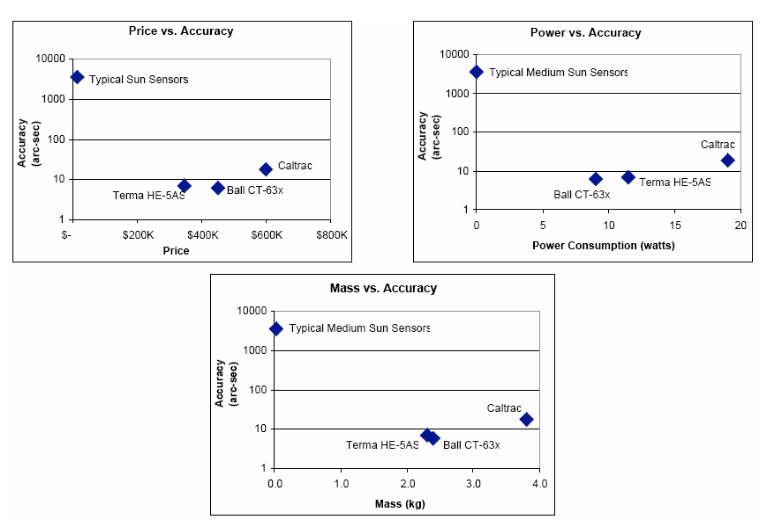
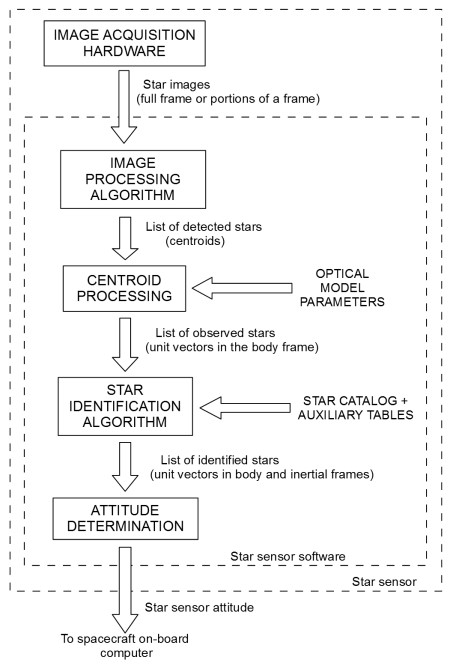
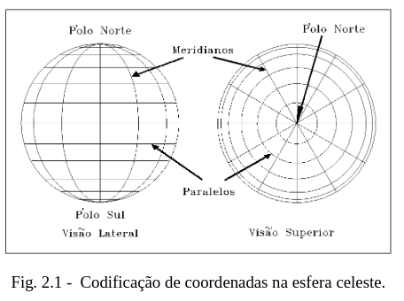
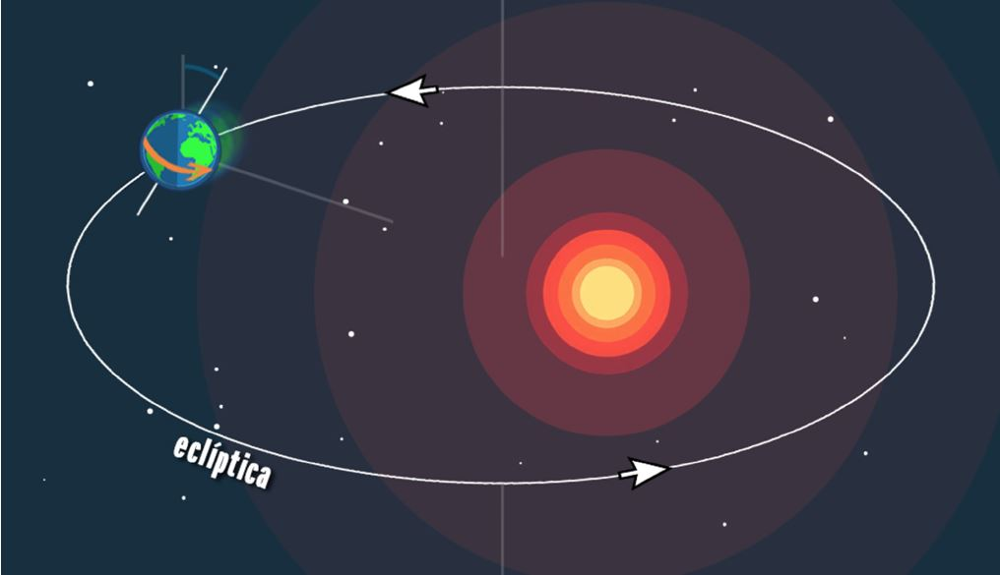
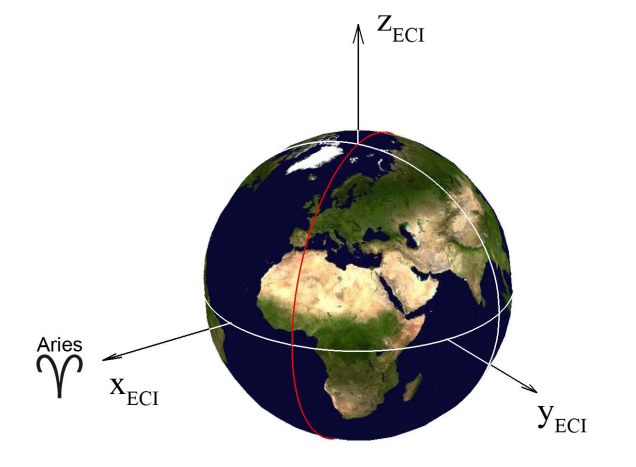
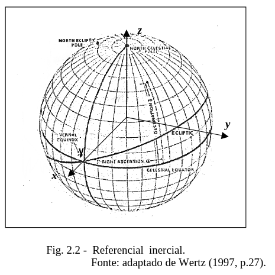
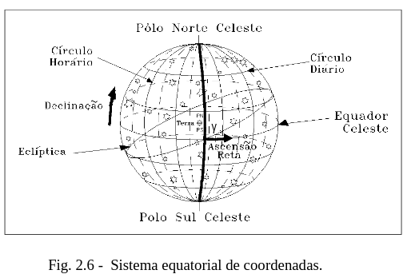
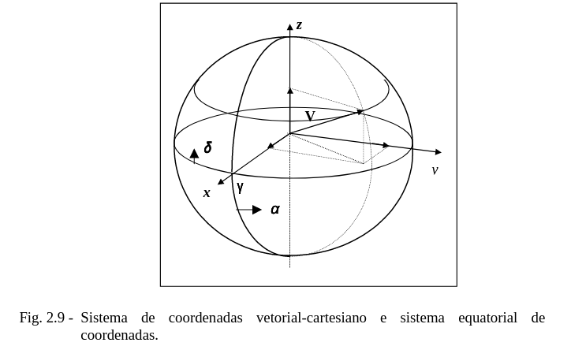

<!-- Output copied to clipboard! -->

<!-----
NEW: Check the "Suppress top comment" option to remove this info from the output.

Conversion time: 5.55 seconds.

Using this Markdown file:

1. Paste this output into your source file.
2. See the notes and action items below regarding this conversion run.
3. Check the rendered output (headings, lists, code blocks, tables) for proper
   formatting and use a linkchecker before you publish this page.

Conversion notes:

* Docs to Markdown version 1.0β31
* Tue Nov 16 2021 03:13:03 GMT-0800 (PST)
* Source doc: Relatorio parcial TG1 V2
* This document has images: check for >>>>>  gd2md-html alert:  inline image link in generated source and store images to your server. NOTE: Images in exported zip file from Google Docs may not appear in  the same order as they do in your doc. Please check the images!

WARNING:
You have 6 H1 headings. You may want to use the "H1 -> H2" option to demote all headings by one level.

----->

Universidade Estadual de Campinas

FEM - Faculdade de Engenharia Mecânica

**Projeto:**

# Desenvolvimento de um rastreador estrelar para determinação de atitude de cubesat 

Aluno: Hebert Wandick Parreira RA: 174335

E-mail: h174335@dac.unicamo.br

Orientador: Rodrigo Moreira Bacurau

E-mail: bacurau@fem.unicamp.br

7 de outubro 2021

[TOC]

# 

# 1 Introdução

Este documento apresenta o Trabalho de Graduação do aluno Hebert Wandick Parreira, que é realizado sob a orientação do Professor Dr. Rodrigo Moreira Bacurau, no curso de Engenharia de Controle e Automação do nível da graduação na Faculdade de Engenharia Mecânica da UNICAMP.

Um dos principais sistemas de um satélite é o sistema de determinação de atitude, o qual é parte do sistema de controle de atitude de um cubesat, que é responsável pela orientação espacial do satélite. Este sistema é de extrema importância, pois os cubesats podem possuir missões nas quais a orientação angular fixa é necessária ou uma variação angular controlada seja necessária, como para tirar fotos da superfície terrestre e fornecer acesso de rede a estação fixa em solo, como por exemplo, é o caso do Starlink.

Durante este projeto, será desenvolvido sistema de rastreamento estrelar para cubesat, com aplicabilidade  na indústria aeroespacial. O sistema será baseado em visão computacional. Pretende-se utilizar webcams convencionais e utilizar como unidade de processamento embarcados de baixo custo que executam Linux, como por exemplo a Raspberry Pi 4.

O foco desse projeto será no desenvolvimento dos algoritmos responsáveis por fazer a captura e análise das imagens, e determinar a posição  angular do cubesat. Para testar o sistema, será desenvolvido uma simulação. Ela consistirá de um monitor juntamente de um software  de simulação do céu estrelado a ser visualizado pelo dispositivo. 

Essa simulação, será desenvolvida em linguagem Python e permitirá a rotação em todo o espaço com 360 graus de liberdade em todos os eixos, por fim será realizada uma validação final com uma webcam.

## 1.1 Motivação

Com o desenvolvimento da eletrônica, os circuitos e sistemas presentes em satélites conseguiram se tornar menores, mais leves, mais baratos, rápidos, e com maior eficiência  energética. Além disso, o desenvolvimento de uma padronização nas dimensões destes pequenos satélites possibilitou um decréscimo ainda maior de custo.

Em universidades e StartUps o estudo e desenvolvimento de cubesats vem crescendo rapidamente, mesmo que os pequenos satélites apresentem limitações físicas e energéticas, o custo benefício em sua aplicabilidade é grande.

Outra limitação está na capacidade do satélite de se localizar e orientar no espaço, ou seja, controlar a sua atitude, que devido às restrições já mencionadas, costumam ser extremamente limitados ou mesmo inexistentes (Diaz, 2006). Com isto as possibilidades de aplicações destes cubesats torna-se consideravelmente limitadas.

A primeira etapa para realizarmos o controle de atitude, é identificar de forma confiável, precisa e contínua a atitude do satélite (Diaz, 2006). No espaço existem pontos de referência que podem ser utilizados para a terminação da atitude, como o Sol, Lua e a Terra, porém estas referências não são consistentes, já que o Sol pode estar encoberto, e a análise da superfície terrestre vista do espaço varia muito, devido a nuvens e outros fenômenos meteorológicos. Além disso, a análise de imagens complexas é custosa computacionalmente, o que devido às limitações de volume e energia, tornam a aplicação extremamente complicada.

Outra opção é utilizar o campo magnético da terra, porém a interferência eletromagnética é algo relativamente comum, uma vez que os próprios circuitos elétricos do satélite podem gerar interferências.

Uma terceira opção é a utilização de uma câmera realizando a análise das estrelas, o fato do satélite estar no espaço faz com que as estrelas estejam na maioria do tempo no campo de visão do satélite (Tappe, 2009).

Realizar o controle de atitude apenas utilizando IMU (_Inertial measurement unit_)  é difícil, pois IMU são suscetíveis a erros de desvio de Offset, erros de Instabilidade, temperatura, são sensíveis a pancadas e vibrações (Young, 2015). Desta forma utiliza-se IMUs de alto custo, que são caros, e em sua maioria, grandes. 

Com a utilização de um dos três métodos de sensorialmente apresentados anteriormente, pode-se utilizar IMUs de menor custo para auxiliar o processo, e fazer fusão sensorial, como o da deriva dos giroscópios, causará erros de orientações consideráveis em poucos segundos se não houver algum outro sistema para identificação de atitude.

Atualmente costuma-se utilizar componentes de prateleira (sensores e chips já prontos e vendidos em massa). Geralmente fazendo uso da tecnologia MEMS (_micro electro mechanical systems_), os quais são relativamente baratos, pequenos e possuem massa reduzida. 

## 1.2 Determinação da Atitude

Atitude de um satélite consiste em sua orientação no espaço, um satélite possui 6 graus de liberdade, (três de rotação e três de translação)  normalmente  modelados em 12 variáveis de estado: 6 variáveis de posição e 6 de suas respectivas derivadas, já que a estabilização e o controle de orientação são normalmente desejados no controle (Souza, 2002).

Do Cálculo sabemos, que a derivada da posição  é a sua velocidade, e sabendo-se o valor da posição a todo instante pode-se calcular a derivada, portanto é possível facilmente obter a informação da velocidade. Desta forma, é necessário apenas a utilização de sensores de posição, o que é verdade, porém a precisão se eleva muito ao utilizarmos múltiplos sensores, e realizarmos uma fusão sensorial completa. 

Este trabalho foca no desenvolvimento do rastreador estelar que é responsável pela determinação da rotação nos 3 eixos, já pensado para a incorporação em tais conjuntos de dados futuramente.

# _2 Star Trackers_

Existem várias formas de se medir a atitude, porém, a forma mais amplamente utilizada em satélites profissionais de grande porte são os seguidores de estrelas (_start trackers_), sistemas profissionais com alta precisão se comparado com outros métodos. A tecnologia de tais sistemas vêm evoluindo nos últimos anos, com a rápida melhoria dos sensores CCD_ (charge-coupled device)_, e tecnologias de análise de imagem. Porém,  erros são  inerentes a qualquer medida, por mais pequeno que um erro possa ser, pode levar a uma identificação errônea de uma estrela, resultado em um erro completo de posicionamento.

_Star Trackers_ funcionam capturando imagens de estrelas e comparando a tabelas salvas em memória (Diaz, 2006). Desta forma, o satélite obtém informações de onde está apontando.

No entanto, os sistemas comerciais possuem preço elevado, consumo de energia elevado e massa elevada, para pequenos satélites, como é mostrado na figura 1:

Figura 1. Comparação de Star Trackers comerciais. Fonte: (Diaz, 2006)

## 2.1 Etapas de operação 

As etapas de operação desse sistema costumam seguir a estrutura apresentada na Figura 2.

Figura 2. Etapas de funcionamento. Fonte: (Fialho, 2017)

A primeira etapa de operação, consiste  na aquisição da imagem a ser utilizada, para tal é utilizado um CCD acoplado a um conjunto de lentes. A escolha desse componentes deve levar em conta uma série de parâmetros, tais como: abertura do campo visual, precisão, volume, peso e outros a variar com a  missão do cubesat (Carvalho, 2001). Neste projeto a aquisição de imagens será feita com uma webcam.

O algoritmo de processamento juntamente com processamento de centróide, são responsáveis por localizar cada uma das estrelas e determinar sua localização e intensidade.

O algoritmo de identificação de estrelas é responsável por fazer a relação entre as estrelas identificadas na observação e as estrelas contidas no banco de dados. A identificação de uma estrela envolve a análise das relações entre as diversas estrelas observadas, para tal utiliza-se algoritmos como de  _Planar Triangles _(Cole & Crassidis, 2006). 

Por fim, é determinada a atitude do cubesat, que pode ser feita utilizando ângulos de Euler ou quaternions. 

Para realizar testes no sistema,  será implementado um simulador estrelar, seguindo o método demonstrado por Tappe (Tappe, 2009). Por fim, serão realizados testes com imagens reais obtidas por webcams  ou câmeras de celulares.  

## 2.2 Esfera celeste

Para aplicação no rastreador estelar, as estrelas são representadas através de uma esfera celeste, na  qual as estrelas são distribuídas em uma esfera ao redor do centro, que na aplicação de satélites é a própria Terra. Devido a diferença de escalas da distância das estrelas a Terra e o tamanho da Terra , pode-se considerar que qualquer ponto na Terra e na órbita terrestre, estão exatamente no centro da esfera. O erro gerado por tal simplificação só  se tornaria visível em missões em que o veículo espacial se retirasse do sistema solar, o que não é caso para Cubesats atuais.

Também é completamente desprezado qualquer movimento que os astros tenham em relação uns aos outros, pois estes movimentos são praticamente nulos em nossas análises. 

Isto se deve o fato de que, o quanto maior for a distância do observador a um objeto, menor será a variação angular para um mesmo movimento linear do objeto, como por exemplo pode-se observar que aviões aparentam estar extremamente lento para um observador na Terra, No caso do sistema estrelar, esse efeito é ainda maior, permitindo desprezar esse movimento relativo entre as estrelas sem nenhum prejuízo prático a precisão (Carvalho, 2001).

Nesta abordagem, algumas das características da Terra são representadas na esfera, como o eixo de rotação em torno de si mesma (rotação) e os pólos geográficos, que são nomeados respectivamente eixo e pólos celestes. Com isto facilita-se a localização dos astro na esfera. Para isto cria-se circunferências envolvendo a esfera, concorrendo nos polos (meridianos), com circunferências perpendiculares ao eixo de rotação(paralelos) (Carvalho, 2001).

Figura 3. Codificação de coordenadas na esfera celeste. Fonte: (Carvalho, 2001)

Como referência tem-se o paralelo central, conhecido como paralelo do Equador,  o meridiano de referência é o que contém o ponto vernal. O ponto vernal é o momento em que o Sol passa o Equador de Sul para Norte, isto ocorre pois a rotação da Terra em torno do próprio eixo está inclinada em relação ao plano da trajetória elíptica da Terra em torno do Sol.Como é visto na figura

Figura 4. Inclinação órbita terrestre. Fonte: (Portal do astrónomo, 2021)

## 2.3 Referencial Inercial Terrestre

Utilizando os conceito da  Esfera celeste, cria-se o referencial inercial terrestres, em que o eixo x está alinhado com vetor radial partindo do Sol em direção a Terra no (linha de Áries), que é o equinócio de inverno, o eixo z é alinhado com o eixo de rotação da Terra, e o eixo y segue a regra da mão direita, conforme as figuras 5 e 6.  

Figura 5. Frame inercial terrestre. Fonte (Diaz, 2006)

Figura 6. Referencial inercial. Fonte: (Carvalho, 2001)

As estrelas são catalogadas utilizando os pontos de referência, já citados, utilizando-se de um sistema de coordenadas polares, com duas coordenadas angulares. Um dos ângulos é definido a partir dos meridianos, que é a ascensão reta 

, o ponto de ares é o marco zero, a ascensão da reta varia de 0 a 360 graus. 

A outra coordenada polar é a declinação, que é o ângulo entre a estrela e o paralelo do equador, variando de -90 a 90 graus. A figura 8 mostra sua representação. 

Figura 7. Sistema equatorial de coordenadas. Fonte (Carvalho, 2001)

A transformação do sistema de coordenadas polares para coordenadas cartesianas é feita  com base na figura 9.

# 4 Referências  

    Carvalho, G. B. (2001). _LEVANTAMENTO DE TÉCNICAS DE IDENTIFICAÇÃO DEESTRELAS E DESENVOLVIMENTO DE UM AMBIENTE DESIMULAÇÃO E TESTES PARA ANÁLISE DE SEUSDESEMPENHOS EM APLICAÇÕES ESPACIAIS_. Inpe. http://marte3.sid.inpe.br/rep/6qtX3pFwXQZ4PKzA/r3xLT

    Cole, C. L., & Crassidis, J. L. (2006, January). _Fast Star Pattern RecognitionUsing Planar Triangles_. Research Gate. https://www.researchgate.net/publication/228376666_Fast_Star-Pattern_Recognition_Using_Planar_Triangles

    Diaz, K. D. (2006, August). _PERFORMANCE ANALYSIS OF A FIXED POINT STAR TRACKER ALGORITHM FOR USE ONBOARD A PICOSATELLITE_. inpe. http://www.inpe.br/nordeste/conasat/arquivos/projetos/CP1/CP1-ADCS-Analisys_of_a_Fixed_Point_Star_Tracker_Algorithm.pdf

    ESA, E. (1997). _The Hipparcos and Tycho Catalogues : I/239_. http://cdsarc.u-strasbg.fr/viz-bin/cat/I/239

    ESA, E. (1997). _Volume 1: Part 1. The Hipparcos and Tycho Catalogues_. ESA. https://www.cosmos.esa.int/documents/532822/552851/vol1_all.pdf

    Fialho, M. A. A. (2017). _IMPROVED STAR IDENTIFICATION ALGORITHMS AND TECHNIQUES FOR MONOCHROME AND COLOR STAR TRACKERS_. Inpe. http://mtc-m21b.sid.inpe.br/col/sid.inpe.br/mtc-m21b/2017/08.10.22.44/doc/publicacao.pdf

    P, N. (2021, Março 20). _Equinócio Vernal, ou, para qual lado é para cima?_ Portal do Astronomo. http://portaldoastronomo.org/2021/03/equinocio-vernal-ou-para-qual-lado-e-para-cima/

    Souza, P. N. (2002). _Curso Introdutório em Tecnologia de Satélites_ [class material]. Inpe. http://mtc-m21c.sid.inpe.br/col/sid.inpe.br/mtc-m21c/2019/08.22.14.06/doc/170_Subsistema%20de%20Controle%20de%20Atitude_P2.2_v1_2002.pdf

    Tappe, J. A. (2009, Dezember). _Development of star tracker system for accurate estimation of spacecraft attitude_ [Abstract This thesis researches different star pattern recognition and attitude determination algorithms for a three-axis rotational spacecraft. A simulated star field will be suspended above the experimental Three-Axis Spacecraft simulator to proved a ref]. calhoun. https://calhoun.nps.edu/bitstream/handle/10945/4335/09Dec_Tappe.pdf?sequence=1&isAllowed=y
